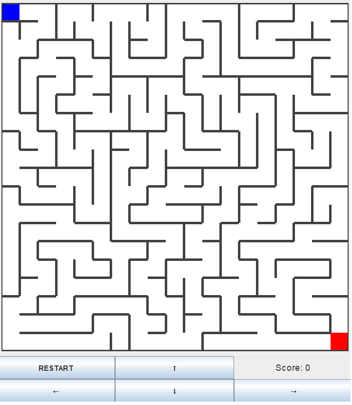

# Maze-generator

The project represents a Java-based application developed with the Swing library, aligning with object-oriented principles to deliver a captivating maze game integrated with maze generation capabilities. This project encompasses the fusion of programming ingenuity, graphical interface design, and algorithmic prowess to create an engaging and interactive gaming experience.

The key feature of this project was  implementation of a maze generation algorithm, which employs advanced data structures and procedural techniques to dynamically construct intricate and challenging mazes.

<b>Maze images:</b>

